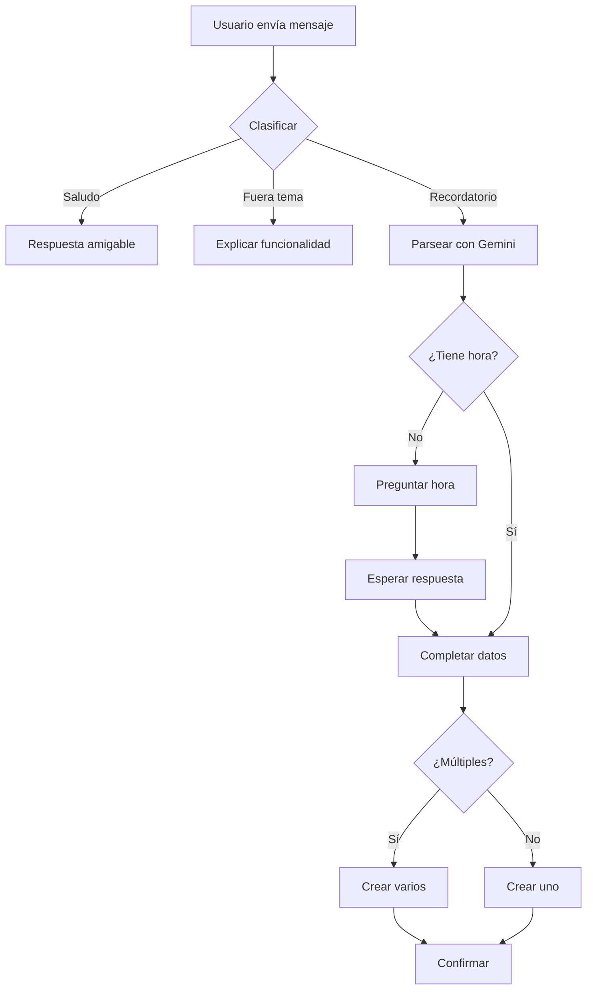

# 🤖 Bot de Recordatorios Inteligente

## 📋 Descripción

Bot de Telegram inteligente que utiliza IA (Google Gemini) para crear y gestionar recordatorios mediante lenguaje natural. El bot comprende solicitudes en español argentino, maneja recordatorios únicos y recurrentes, y envía notificaciones personalizadas con mensajes graciosos generados por IA.

---

## 🎯 Funcionalidades Principales

### ✅ Creación de Recordatorios
- **Lenguaje Natural**: El usuario escribe en español natural y la IA interpreta la intención
  - Ejemplos: *"recordame comprar pan mañana a las 10"*, *"estudiar para el examen el viernes"*
- **Múltiples recordatorios**: Detecta y crea varios recordatorios en un solo mensaje
- **Recordatorios recurrentes**: Soporta repeticiones periódicas
  - Tipos: minutal, horario, diario, semanal, mensual, anual
  - Ejemplos: *"todos los lunes a las 9"*, *"cada 4 horas"*
- **Detección inteligente de hora**: Si falta la hora, pregunta de forma natural

### 🔄 Edición Inteligente
- **Ediciones contextuales**: Interpreta cambios parciales
  - Ejemplo: *"el examen era el martes no el lunes"* → actualiza solo la fecha
- **Versionado**: Mantiene historial de cambios (cada edición crea nueva versión)
- **Validaciones**: Solo permite editar recordatorios futuros

### 📋 Gestión de Recordatorios
- **Listado semanal**: Muestra recordatorios de los próximos 7 días
- **Eliminación**: Individual (con confirmación) o masiva
- **Interfaz con botones**: Menú interactivo con InlineKeyboard
- **Protección anti-flood**: Límites de creación para prevenir spam

### 🔔 Notificaciones
- **Scheduler en segundo plano**: Verifica recordatorios cada 10 segundos
- **Mensajes personalizados**: Gemini genera mensajes graciosos relacionados con la tarea
- **Contexto inteligente**: Extrae información relevante del mensaje original
- **Gestión de recurrencia**: Actualiza automáticamente la próxima fecha

### 🛡️ Validaciones y Seguridad
- **Límites de recordatorios**: Máximo 200 activos por usuario
- **Control de velocidad**: Máximo 20 creaciones por minuto
- **Validación de fechas**: Rechaza fechas pasadas.
- **Eliminación lógica**: Los recordatorios no se borran físicamente

---

## 🏗️ Arquitectura del Sistema

### Estructura Modular

```
recordatorios/
├── bot_recordatorios.py    # Punto de entrada, configuración handlers
├── config.py                # Configuración centralizada
├── database.py              # Gestión de MySQL con pooling
├── gemini_service.py        # Integración con Google Gemini AI
├── handlers.py              # Handlers de comandos Telegram
├── scheduler.py             # Scheduler de notificaciones
├── timezone_utils.py        # Utilidades de zona horaria
├── requirements.txt         # Dependencias del proyecto
└── db_recordatorios.sql    # Schema de base de datos
```

### Flujo de Datos

```
Usuario → Telegram → Handlers → Gemini AI → Database
                                    ↓
                            Scheduler → Notificaciones
```

---

## 🔧 Tecnologías Utilizadas

### 🐍 Python 3.8+
Lenguaje principal del proyecto, elegido por su ecosistema robusto para bots y IA.

### 📱 python-telegram-bot (v20+)
Librería oficial para Telegram Bot API con soporte async/await.

**Características utilizadas:**
- `Application`: Gestión del bot y polling
- `CommandHandler`: Manejo de comandos (`/start`, `/listar`, etc.)
- `MessageHandler`: Procesamiento de mensajes de texto
- `ConversationHandler`: Flujos de conversación (edición, creación)
- `CallbackQueryHandler`: Manejo de botones inline
- `InlineKeyboardMarkup`: Interfaz de botones interactivos

### 🤖 Google Generative AI (Gemini)
Motor de IA para procesamiento de lenguaje natural.

**Uso en el proyecto:**
- **Modelo**: `gemini-2.5-flash`
- **Parsing de recordatorios**: Extrae tarea, fecha, hora y recurrencia
- **Clasificación de mensajes**: Distingue recordatorios de saludos o preguntas
- **Generación de texto**: Crea mensajes graciosos personalizados
- **Extracción de contexto**: Identifica información relevante del mensaje

**Prompts principales:**
1. `parse_reminder`: Convierte texto a JSON estructurado
2. `parse_multiple_reminders`: Detecta múltiples recordatorios
3. `parse_reminder_edit`: Interpreta ediciones contextuales
4. `classify_and_respond`: Clasifica intención del mensaje
5. `generate_funny_reminder_message`: Genera notificaciones con humor

### 🗄️ MySQL
Base de datos relacional para persistencia.

**Características:**
- **Connection Pooling**: Pool de 5 conexiones para mejor rendimiento
- **Transacciones**: Uso de context managers para seguridad
- **Índices**: Optimización de consultas frecuentes

**Esquema principal:**
```sql
recordatorios (
  id INT AUTO_INCREMENT PRIMARY KEY,
  chat_id BIGINT,
  tarea TEXT,
  contexto_original TEXT,
  fecha_hora DATETIME,
  notificado TINYINT,
  es_recurrente TINYINT,
  tipo_recurrencia ENUM('minutal','horario','diario','semanal','mensual','anual'),
  intervalo_recurrencia INT,
  dias_semana VARCHAR(50),
  fecha_fin_recurrencia DATETIME,
  version INT,
  recordatorio_original_id INT,
  es_version_actual TINYINT,
  eliminado TINYINT,
  fecha_eliminacion DATETIME,
  username VARCHAR(255),
  fecha_creacion TIMESTAMP,
  fecha_modificacion TIMESTAMP,
  ultima_ejecucion DATETIME
)
```

### 🌍 python-dotenv
Gestión de variables de entorno sensibles.

**Variables requeridas:**
```env
TELEGRAM_TOKEN=tu_token_aqui
GEMINI_API_KEY=tu_api_key_aqui
GEMINI_MODEL=gemini-2.0-flash-exp
DB_HOST=localhost
DB_PORT=3306
DB_USER=usuario
DB_PASSWORD=contraseña
DB_NAME=bot_recordatorios
SCHEDULER_INTERVAL=10
```

### 🕐 pytz
Manejo de zonas horarias (America/Argentina/Buenos_Aires).

**Funciones principales:**
- `to_utc()`: Convierte hora Argentina a UTC (para almacenar)
- `to_argentina()`: Convierte UTC a hora Argentina (para mostrar)
- `now_for_user()`: Obtiene hora actual del usuario
- `format_datetime_argentina()`: Formatea fechas en español

---

## 🧩 Lógica del Bot

### 1️⃣ Inicialización (`bot_recordatorios.py`)

```python
# Flujo de arranque:
1. Cargar configuración desde .env
2. Inicializar DatabaseManager (crear pool de conexiones)
3. Inicializar GeminiService (configurar API)
4. Inicializar TelegramHandlers (inyectar dependencias)
5. Iniciar ReminderScheduler en thread separado
6. Configurar Application de Telegram con handlers
7. Iniciar polling
```

### 2️⃣ Creación de Recordatorios (`handlers.py`)

**Flujo completo:**

```python
Usuario escribe: "recordame comprar pan mañana a las 10"
      ↓
1. classify_and_respond() → determina si es recordatorio
      ↓
2. parse_multiple_reminders() → extrae datos estructurados
   Resultado: [
     {
       "tarea": "comprar pan",
       "fecha": "2025-11-06",
       "hora": "10:00:00",
       "hora_especificada": true,
       "contexto_original": "recordame comprar pan mañana a las 10",
       "es_recurrente": false
     }
   ]
      ↓
3. Validar límites anti-flood
      ↓
4. Convertir hora Argentina → UTC
      ↓
5. Guardar en database con create_reminder()
      ↓
6. Confirmar al usuario con mensaje formateado
```

**Caso especial - Sin hora:**
```python
Usuario: "estudiar para el examen mañana"
      ↓
1. Detecta hora_especificada: false
      ↓
2. Guarda en context.user_data
      ↓
3. Pregunta con ask_for_time(): "¿A qué hora querés que te recuerde?"
      ↓
4. Usuario responde: "15:00"
      ↓
5. Parsea hora y completa el recordatorio
```

### 3️⃣ Recordatorios Recurrentes

**Ejemplo de prompt a Gemini:**
```
Usuario: "todos los lunes a las 9 ir al gimnasio"

Gemini responde:
{
  "es_recurrente": true,
  "tipo_recurrencia": "semanal",
  "intervalo": 1,
  "tarea": "ir al gimnasio",
  "fecha": "2025-11-11",  // Próximo lunes
  "hora": "09:00:00",
  "dias_semana": [1],  // 1 = lunes
  "fecha_fin": null
}
```

**Gestión en scheduler:**
```python
1. Enviar notificación en fecha programada
      ↓
2. Calcular próxima fecha según tipo_recurrencia
      ↓
3. Actualizar MISMO registro con nueva fecha
      ↓
4. Si alcanza fecha_fin → marcar como notificado (finalizar)
```

### 4️⃣ Edición Contextual

**Ejemplo avanzado:**
```python
Original: "repasar para examen de química el lunes 18:00"
Usuario: "el examen era el martes no el lunes"

parse_reminder_edit() analiza:
- Contexto original completo
- Intención del cambio
- Qué mantener y qué actualizar

Resultado:
{
  "tarea": "repasar para examen de química",
  "fecha_hora": "2025-11-12 18:00:00",  // Cambió solo el día
  "contexto_original": "el examen era el martes no el lunes"
}
```

### 5️⃣ Scheduler (`scheduler.py`)

**Thread en segundo plano:**

```python
# Cada 10 segundos:
while not stop_event.is_set():
    1. get_due_reminders() → consulta recordatorios vencidos
    2. Para cada recordatorio:
       a. Verificar si es recurrente
       b. generate_funny_reminder_message() → crear mensaje IA
       c. extract_smart_context() → extraer info relevante
       d. Enviar notificación con botones
       e. Si es recurrente:
          - update_recurrent_reminder_next_date()
          Si NO es recurrente:
          - mark_as_notified()
    3. Esperar intervalo (10s)
```

### 6️⃣ Versionado de Recordatorios

**Sistema de versiones:**
```sql
-- Recordatorio original (v1)
id=100, version=1, recordatorio_original_id=NULL, es_version_actual=1

-- Usuario edita (crea v2)
id=101, version=2, recordatorio_original_id=100, es_version_actual=1
(v1 cambia es_version_actual=0)

-- Ventajas:
- Historial completo de cambios
- Posibilidad de auditoría
- No se pierde información
```

---

## 🔍 Características Técnicas Destacadas

### 🎨 Mensajes Personalizados con IA

**Antes (sin IA):**
```
🔔 RECORDATORIO
📌 Comprar pan
```

**Ahora (con Gemini):**
```
🔔 ¡RECORDATORIO! 🔔

📌 Comprar pan
💬 Para el desayuno de mañana

💸 El pan no se compra solo! Andá antes que cierre la panadería 🥖😅
```

### 🧠 Procesamiento de Lenguaje Natural

**Capacidades:**
- Interpreta fechas relativas: "mañana", "en 2 horas", "el próximo viernes"
- Entiende formatos de hora diversos: "10am", "15:30", "3 de la tarde"
- Detecta intenciones implícitas: "tengo que estudiar mañana" → recordatorio de "estudiar"
- Convierte a infinitivo automáticamente: "debo comprar" → "comprar"

### 🔐 Seguridad y Límites

```python
# Protecciones implementadas:
- 200 recordatorios activos máximo por usuario
- 20 creaciones por minuto máximo
- Validación de intervalos de recurrencia razonables
- Eliminación lógica (soft delete)
- Validación de permisos por chat_id
```

### ⏰ Gestión de Zonas Horarias

```python
# Todo almacenado en UTC, mostrado en Argentina
to_utc("2025-11-06 10:00:00 ART") → "2025-11-06 13:00:00 UTC"
to_argentina("2025-11-06 13:00:00 UTC") → "2025-11-06 10:00:00 ART"
```

### 🎯 Optimizaciones de Rendimiento

- **Connection Pooling**: Reutilización de conexiones MySQL
- **Async/Await**: Operaciones no bloqueantes con Telegram y Gemini
- **Índices de DB**: En `chat_id`, `fecha_hora`, `notificado`, `eliminado`
- **Consultas optimizadas**: Solo recordatorios de próximos 7 días en listado

---

## 📊 Flujo de Conversación



---

## 🚀 Instalación y Configuración

### Requisitos Previos
- Python 3.8 o superior
- MySQL 8.0 o superior
- Cuenta de Telegram (Bot Token)
- API Key de Google Gemini

### Pasos de Instalación

1. **Clonar repositorio**
```bash
git clone https://github.com/InfernalBahamut/MemoBOT.git
cd recordatorios
```

2. **Instalar dependencias**
```bash
pip install -r requirements.txt
```

3. **Configurar base de datos**
```bash
mysql -u root -p < db_recordatorios.sql
```

4. **Configurar variables de entorno**
```bash
cp .env.example .env
# Editar .env con tus credenciales
```

5. **Ejecutar bot**
```bash
python bot_recordatorios.py
```

---

## 📝 Comandos Disponibles

| Comando | Descripción |
|---------|-------------|
| `/start` | Inicia el bot y muestra menú principal |
| `/menu` | Muestra el menú de opciones |
| `/listar` | Lista recordatorios de la semana |
| `/eliminar` | Elimina todos los recordatorios (con confirmación) |
| `/cancelar` | Cancela operación de edición en curso |

---

## 🎓 Ejemplos de Uso

### Crear recordatorio simple
```
Usuario: comprar leche mañana a las 10
Bot: ✅ ¡Recordatorio agendado!
     📌 comprar leche
     📅 miércoles 6 de noviembre a las 10:00 hs
```

### Crear recordatorio recurrente
```
Usuario: todos los lunes a las 9 ir al gimnasio
Bot: ✅ ¡Recordatorio recurrente agendado!
     📌 ir al gimnasio
     🔄 Se repetirá semanalmente
     📅 Primera vez: lunes 11 de noviembre a las 09:00 hs
```

### Editar recordatorio
```
/listar → presionar ✏️ junto al recordatorio
Usuario: mejor a las 15 en vez de las 10
Bot: ✅ Recordatorio actualizado!
     📌 comprar leche
     📅 miércoles 6 de noviembre a las 15:00 hs
```

---

## 👥 Autor

**Mariano Cabeda** y **Lucas Medina** - Trabajo Final  
Repositorio: [MemoBOT](https://github.com/InfernalBahamut/MemoBOT)

---

## 📄 Licencia

Este proyecto fue desarrollado como trabajo final académico.

---

## 🙏 Agradecimientos

- **Google Gemini**: Por la potente API de IA
- **Telegram**: Por la plataforma de bots
- **python-telegram-bot**: Por la excelente librería

---

**Última actualización:** Noviembre 2025
